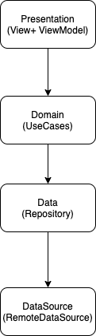

# BeerInformation

## Requirements
- Kotlin 1.3x
- Android API 23+
- JDK at least 1.8

## Installation

#### Dependencies
For Gradle dependencies, `Android Studio` will take care of them. So, simply open project in Android Studio then wait
for Gradle Sync. You are ready to go! Used libraries in the project is :  

- Retrofit2  
- Moshi  
- Glide  
- Jetpack Architecture Components (Coroutines, LiveData, Jetpack Navigation)  
- SafeArgs Plugin : is a Gradle Plugin that generates code to help guarantee that the arguments on both side matches up while also simplifying argument passing between fragments.
- Koin for dependency Injection

## Structure  
The used architectural pattern in the project is MVVM with Clean Architecture. Project consist of 4 layers   
- Presentation : Includes activities, fragments, view-models and UI related things.   
- Domain : Includes usecases, domain object models, repository interfaces.   
- Data : Includes repository implementations, data-level model objects, data-source interfaces.  
- DataSource : Includes data-source implementations, API interfaces, response handlers and data-source models.   
   

Commit Message Convention 

 - feat: A new feature   
 - fix: A bug fix.  
 - docs: Documentation only changes.  
 - style: Changes that do not affect the meaning of the code (white-space, formatting, missing semi-colons, etc).  
 - refactor: A code change that neither fixes a bug nor adds a feature.  
 - perf: A code change that improves performance.  
 - test: Adding missing or correcting existing tests.  
 - chore: Changes to the build process or auxiliary tools and libraries such as documentation generation.  
